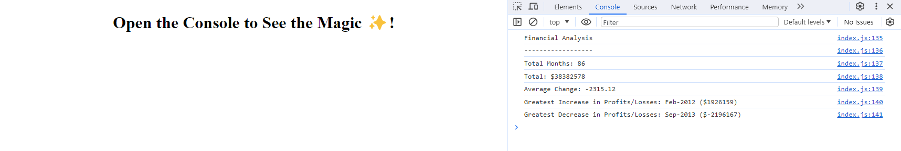

# Console-Finances

## Description

My motivation for this project was to use JavaScript to figure out a real-world situation using if statements and for loops to create code to analyse the financial records of a company that are kept in an array. This webpage is where I have built the algorithm to work out various things off financial data such as total months, the net amount of Profit/Losses over the entire period, the average in changes in Profit/Losses over the entire period and also the greatest increase and decrease in Profit/Losses showing the date and amount. This solves a problem of having to manually work out the analytics of the financial records. 

## Screenshot

## Installation

N/A

## Usage

This algorithm can be used to analyse the financials records of a company. To use the algorithm you must inspect the webpage and go into the console log where it will show the Financial Analysis.

## Link

https://mtlightfoot.github.io/console-finances/

## Credits

N/A

## License

Please refer to the LICENSE in the repo.